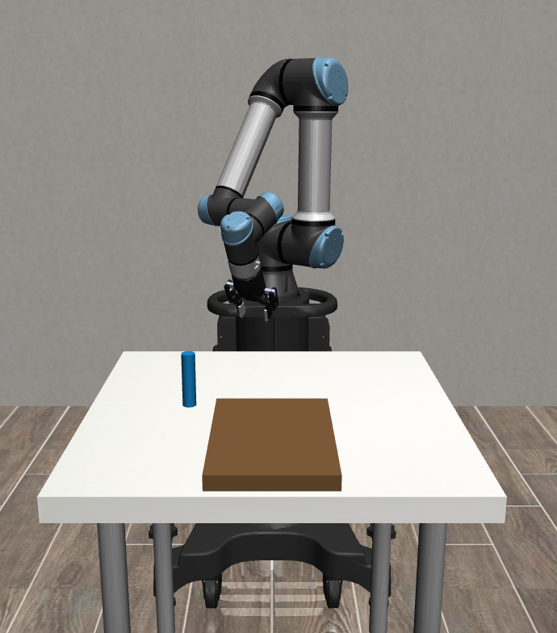

# Robotic Arm Reinforcement Learning


## Setup
Create and activate a conda environment:
```bash
conda create -n arm-rl python=3.9
conda activate arm-rl
```

Install dependencies:
```bash
pip install -r requirements.txt
```

## Training
Run training:
```bash
python main.py
```

## Demo
Run the demo (renders the environment and shows the wrist camera feed if available):
```bash
python demo_tube_pick_place.py
```
